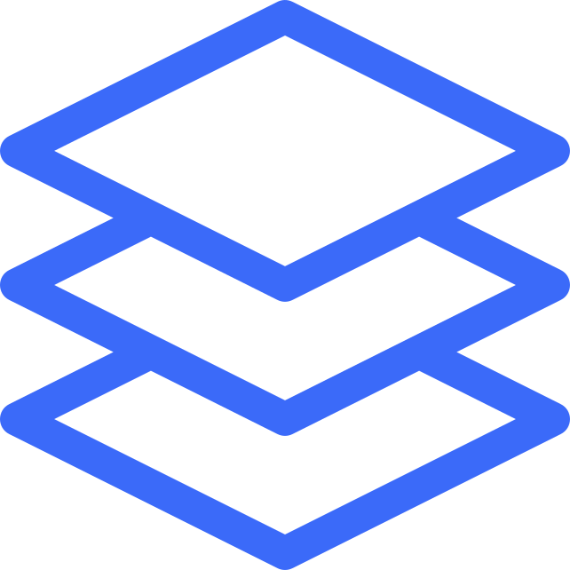

# @todo
- [ ] add smtp server for domains
- [ ] add docker deployment management

---

  

# datum
`datum` is a Node.js framework that improves API development, focusing on complete automatic REST API exposure from Mongoose models.
The framework favors a heavily opinionated design pattern that encourages placing more complex logic into model methods and statics combined
with libraries. This increases protoyping and MVP speed while also providing an intuitive pattern
that is easy to pick up on.

In contrast to MVC, where you would typically place your logic in Controllers,
this framework is considered Model/Library/Route (MLR). With the R being optional.

Where logic doesn't fit in the context of a model method or static, you can expose a method within a custom route, which somewhat acts like
a typical controller, having access to both libraries and all models to work from.
